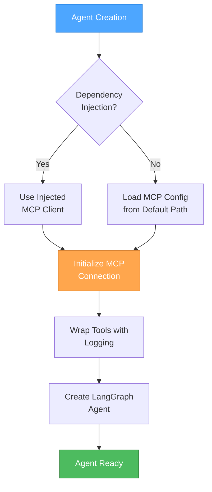

🎨🎨🎨 ENTERING CREATIVE PHASE: AGENT INTERFACE ARCHITECTURE 🎨🎨🎨

📌 CREATIVE PHASE START: Agent Interface Architecture
━━━━━━━━━━━━━━━━━━━━━━━━━━━━━━━

1️⃣ PROBLEM
   Description: Design the SubAgentInterface architecture for async initialization and MCP integration
   Requirements: 
   - Support async initialization pattern
   - MCP server loading and management
   - LLM and mcp_config parameter injection
   - Default config path resolution (agent location + mcp_config.json)
   - Tool wrapping and tracing capabilities
   - IPython/Jupyter compatibility (Python 3.11+)
   
   Constraints: 
   - Must inherit from existing AgentInterface
   - Maintain backward compatibility
   - Support dependency injection patterns
   - Async-first design for IPython environments

2️⃣ OPTIONS
   Option A: Enhanced Inheritance - Extend current SubAgentInterface with async methods
   Option B: Factory Pattern - Create AgentFactory with builder pattern for complex setup
   Option C: Mixin Pattern - Separate concerns with MCPMixin and AsyncMixin classes

3️⃣ ANALYSIS
   | Criterion | Enhanced Inheritance | Factory Pattern | Mixin Pattern |
   |-----|-----|-----|-----|
   | Simplicity | ⭐⭐⭐⭐ | ⭐⭐ | ⭐⭐⭐ |
   | Flexibility | ⭐⭐⭐ | ⭐⭐⭐⭐⭐ | ⭐⭐⭐⭐ |
   | Maintainability | ⭐⭐⭐⭐ | ⭐⭐⭐ | ⭐⭐⭐⭐⭐ |
   | Testability | ⭐⭐⭐ | ⭐⭐⭐⭐⭐ | ⭐⭐⭐⭐ |
   | Learning Curve | ⭐⭐⭐⭐⭐ | ⭐⭐ | ⭐⭐⭐ |
   
   Key Insights:
   - Enhanced Inheritance offers simplest migration path from existing code
   - Factory Pattern provides maximum flexibility but increases complexity
   - Mixin Pattern offers best separation of concerns and testing capabilities

4️⃣ DECISION
   Selected: Option A: Enhanced Inheritance with async initialization
   Rationale: Best balance of simplicity and functionality for this refactoring project. 
   Maintains familiar interface while adding required async capabilities.
   
5️⃣ IMPLEMENTATION NOTES
   - Add async def _initialize(self) method to SubAgentInterface
   - Implement default config path resolution: Path(agent_file).parent / "mcp_config.json"
   - Add _mcp_client and _model_config attributes with dependency injection support
   - Create _wrap_tools_with_logging method for MCP tool tracing
   - Ensure nest_asyncio compatibility for IPython environments
   - Support both constructor injection and default path loading

🎨 CREATIVE CHECKPOINT: Architecture Pattern Selected

## Detailed Architecture Design

### Class Hierarchy
```python
AgentInterface (ABC)
├── query(user_prompt: str, **kwargs) -> str
├── config: Dict[str, Any]
└── __init__(config: Optional[Dict[str, Any]] = None)

SubAgentInterface(AgentInterface) (ABC)
├── process(state: Dict[str, Any]) -> Dict[str, Any]
├── async def _initialize(self) -> None  # NEW
├── _mcp_client: Optional[MultiServerMCPClient]  # NEW
├── _model_config: Optional[ModelConfig]  # NEW
├── _get_mcp_config(self) -> Dict[str, Any]  # NEW
├── _wrap_tools_with_logging(self, tools) -> List[Tool]  # NEW
└── __init__(config, mcp_client=None, model_config=None)  # ENHANCED
```

### Initialization Flow


### Configuration Loading Strategy
```python
def _get_mcp_config(self) -> Dict[str, Any]:
    """Load MCP configuration with fallback strategy."""
    config_paths = [
        # 1. Injected path (if provided)
        getattr(self, '_config_path', None),
        # 2. Agent location + mcp_config.json
        Path(inspect.getfile(self.__class__)).parent / "mcp_config.json",
        # 3. Project root fallback paths
        Path.cwd() / "mcp_config.json",
        Path.cwd().parent / "mcp_config.json",
    ]
    
    for path in filter(None, config_paths):
        if path.exists():
            return self._load_and_validate_config(path)
    
    raise FileNotFoundError("No valid MCP configuration found")
```

━━━━━━━━━━━━━━━━━━━━━━━━━━━━━━━
📌 CREATIVE PHASE END: Agent Interface Architecture

🎨🎨🎨 EXITING CREATIVE PHASE - ARCHITECTURE DECISION MADE 🎨🎨🎨
