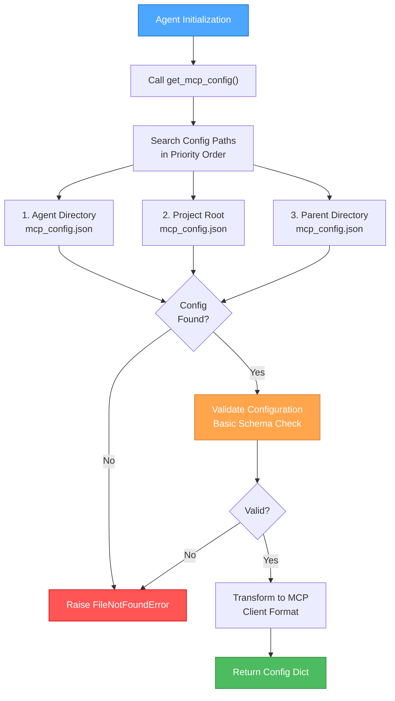

🎨🎨🎨 ENTERING CREATIVE PHASE: MCP INTEGRATION STRATEGY 🎨🎨🎨

📌 CREATIVE PHASE START: MCP Integration & Configuration Management
━━━━━━━━━━━━━━━━━━━━━━━━━━━━━━━

1️⃣ PROBLEM
   Description: Design MCP server integration, configuration loading, and tool management system
   Requirements:
   - Support multiple MCP server configurations
   - Centralized configuration loading (remove from individual agents)
   - Tool wrapping for SQL query tracing
   - MySQL MCP server integration
   - Configuration validation and error handling
   - Support for both development and production environments
   
   Constraints:
   - Must work with existing langchain-mcp-adapters
   - Configuration files should be JSON format
   - Support multiple config file locations
   - Maintain logging separation (centralized logging)

2️⃣ OPTIONS
   Option A: Centralized Config Manager - Single MCPConfigManager class handles all config
   Option B: Agent-Level Config Loading - Each agent loads its own config with shared utilities
   Option C: Hybrid Approach - Central manager with agent-specific overrides

3️⃣ ANALYSIS
   | Criterion | Centralized Manager | Agent-Level Loading | Hybrid Approach |
   |-----|-----|-----|-----|
   | Simplicity | ⭐⭐⭐ | ⭐⭐⭐⭐ | ⭐⭐ |
   | Configuration Reuse | ⭐⭐⭐⭐⭐ | ⭐⭐ | ⭐⭐⭐⭐ |
   | Agent Independence | ⭐⭐ | ⭐⭐⭐⭐⭐ | ⭐⭐⭐⭐ |
   | Testing Isolation | ⭐⭐ | ⭐⭐⭐⭐⭐ | ⭐⭐⭐ |
   | Debugging | ⭐⭐⭐⭐ | ⭐⭐⭐ | ⭐⭐⭐⭐ |
   
   Key Insights:
   - Centralized Manager reduces duplication but creates tight coupling
   - Agent-Level Loading offers maximum flexibility and testability
   - Hybrid Approach provides good balance but adds complexity

4️⃣ DECISION
   Selected: Option B: Agent-Level Config Loading with shared utilities
   Rationale: Aligns with design_doc.md requirement to "offload logic from eda_agent to agent_interface".
   Provides maximum testability and agent independence while sharing common utilities.
   
5️⃣ IMPLEMENTATION NOTES
   - Create core/mcp_load.py with shared utilities
   - Implement get_mcp_config() method in agent interface
   - Add configuration validation without logging dependencies
   - Support multiple config file locations with fallback strategy
   - Create tool wrapping utilities for SQL tracing

🎨 CREATIVE CHECKPOINT: MCP Integration Strategy Selected

## Detailed MCP Integration Design

### Core Module Structure
```
src/agentdk/core/
├── mcp_load.py          # MCP configuration utilities
├── logging_config.py    # Centralized logging (separate from MCP)
└── __init__.py
```

### MCP Configuration Loading Flow


### Configuration File Format
```json
{
  "mcpServers": {
    "mysql": {
      "command": "python",
      "args": ["-m", "mysql_mcp_server"],
      "env": {
        "MYSQL_HOST": "localhost",
        "MYSQL_PORT": "3306",
        "MYSQL_USER": "test_user",
        "MYSQL_PASSWORD": "test_password",
        "MYSQL_DATABASE": "test_db"
      },
      "transport": "stdio"
    }
  }
}
```

### Tool Wrapping Strategy
```python
def _wrap_tools_with_logging(self, tools: List[Tool]) -> List[Tool]:
    """Wrap MCP tools to log SQL queries and parameters."""
    wrapped_tools = []
    
    for tool in tools:
        if self._is_sql_tool(tool):
            wrapped_tool = self._create_sql_logging_wrapper(tool)
        else:
            wrapped_tool = self._create_generic_logging_wrapper(tool)
        wrapped_tools.append(wrapped_tool)
    
    return wrapped_tools

def _create_sql_logging_wrapper(self, tool: Tool) -> Tool:
    """Create wrapper that logs SQL queries before execution."""
    original_func = tool.func
    
    async def logged_sql_invoke(**kwargs):
        # Log SQL query with parameters (without exposing sensitive data)
        query = kwargs.get('query', 'Unknown query')
        self._log_sql_execution(query, tool.name)
        
        # Execute original tool
        result = await original_func(**kwargs)
        
        # Log result summary
        self._log_sql_result(result, tool.name)
        return result
    
    return StructuredTool(
        name=tool.name,
        description=tool.description,
        args_schema=tool.args_schema,
        func=logged_sql_invoke
    )
```

### MySQL MCP Server Integration
```python
# Example configuration for MySQL MCP server integration
def _setup_mysql_mcp_server(self) -> Dict[str, Any]:
    """Setup configuration for MySQL MCP server integration."""
    return {
        "mysql": {
            "command": "python",
            "args": ["-m", "mysql_mcp_server"],
            "env": {
                "MYSQL_HOST": os.getenv("MYSQL_HOST", "localhost"),
                "MYSQL_PORT": os.getenv("MYSQL_PORT", "3306"),
                "MYSQL_USER": os.getenv("MYSQL_USER", "agentdk_user"),
                "MYSQL_PASSWORD": os.getenv("MYSQL_PASSWORD", ""),
                "MYSQL_DATABASE": os.getenv("MYSQL_DATABASE", "agentdk_test"),
                "LOG_LEVEL": "INFO"
            },
            "transport": "stdio"
        }
    }
```

### Configuration Validation Schema
```python
def _validate_mcp_config(self, config: Dict[str, Any]) -> bool:
    """Basic validation of MCP configuration structure."""
    required_fields = ["mcpServers"]
    
    if not all(field in config for field in required_fields):
        return False
    
    for server_name, server_config in config["mcpServers"].items():
        if not self._validate_server_config(server_config):
            return False
    
    return True

def _validate_server_config(self, server_config: Dict[str, Any]) -> bool:
    """Validate individual server configuration."""
    required_fields = ["command", "args"]
    return all(field in server_config for field in required_fields)
```

━━━━━━━━━━━━━━━━━━━━━━━━━━━━━━━
📌 CREATIVE PHASE END: MCP Integration Strategy

🎨🎨🎨 EXITING CREATIVE PHASE - MCP INTEGRATION STRATEGY DECIDED 🎨🎨🎨
